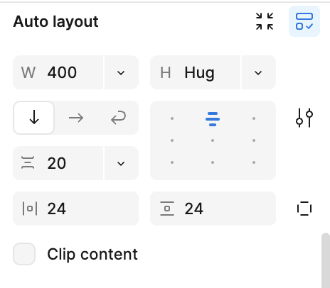

# Leerlog week 2

## Maandag 8/9

Componenten hergebruiken helpt om consistent en efficient te ontwerpen, als een component op een plek wordt aangepast, wordt het overal aangepast.

In de componenten en op artboards kan je ook auto layout toepassen.

## Dinsdag 9/9

Ik wilde vanilla JavaScript in mijn Svelteproject gebruiken, maar kreeg een internal error. Ik besefte meteen dat de JavaScript op een andere manier geschreven moest worden. Op [Medium](https://medium.com/@edwinchiamaka2001/a-guide-to-dom-manipulation-in-sveltekit-2db08ccfbb39) heb ik gelezen over de juiste methoden hiervoor. De "onMount" functie zou gebruikt moeten worden.

## Woensdag 10/9

ul: display flex, met 3 li (kan je gebruiken voor een header)

`li:first-of-type {` 
`margin-right: auto;`
`}`

CSS [attribute=”value”] selector

`a href..................target=”_blank=”`

### Creative coding with sveltekit

**Progressive enhancement**

...is a strategy in web design that emphasizes web content first. It allows everyone to access the basic content and functionality of a web page, while users with additional browser features or faster internet access receive an enhanced version.

Creative coding  ===  progressive enhancement  (←  should be)  ===   content first

**Progressive enhancement: content first** 

 *(deze stappenplan gebruiken voor alle sveltekit projecten)*

1. maak een tijdelijke kopie van de folder van de squadpage repo
2. installeer een clean install van sveltekit voor de squadpage
3. voeg in /routes/+page.js deze regel code toe export let csr = false    *(dit kan je aanpassen)*
4. neeem in /lib/fetch-node.js de code over uit hetzelfde bestand van je laatste node.js project van sprint 12
5. importeer deze function in /routes/+page.server.js
6. check aan de hand van het voorbeeld of je alles goed gedaan hebt 
7. copy/paste jullie toegevoegde svelte code terug in /route/+page.svelte

**Creative coding with css**

`ul {`

`scroll-snap-type: x mandatory;`

`}`

`li {`

`scroll-snap-align: center:`

`}`

`@supports (animation-timeline: scroll ( ) ) {`

`ul li {`

`view-timeline-name: —happy-scroller`

`animation: linear appear both;`

`}`

**creative coding with JavaScript** 

svelte heeft standaard animatie elementen

`<svelte:window on:mousemove={followPointer} />`

`export let csr = false` ← client side rendering is uit

`export let csr = true` ← client side rendering is aan

SvelteKit zal er alles aan doen om ervoor te zorgen dat requests en responses niet door jou uitgevoerd hoeven te worden, maar dat SvelteKit dat doet.

Dom-elementen herkent hij dus niet. `onMount` gebruiken  ← component lifecycle functie 

Een page in sveltekit is een component.

Je kan in de js, css manipuleren (je animeert met custom properties)

in de html kun je iets binden aan de js.

Zie ook svelte transitions op svelte.dev